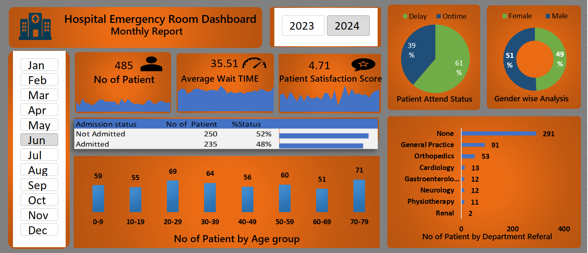

# 🏥 Hospital Emergency Room Data Analysis Dashboard

This project presents an **interactive Hospital Emergency Room Analysis Dashboard** built using **Microsoft Excel**.  
It helps hospital management to monitor patient flow, analyze performance, and make data-driven decisions for better emergency care services.

---

## 📊 Objective
The main goal of this dashboard is to analyze **emergency room patient data** to enhance operational efficiency and service quality.  
This project provides insights into:
- Patient admission trends  
- Gender and age distribution  
- Timeliness of emergency responses  
- Department-wise referrals  

---

## ⚙️ Key Performance Indicators (KPIs)

| KPI | Description |
|-----|--------------|
| **Total Patients** | Total number of patients who visited the emergency department. |
| **Admitted Patients (%)** | Percentage of patients admitted compared to total visitors. |
| **Seen Within 30 Minutes (%)** | Measures how quickly patients received initial attention. |
| **Gender Ratio (M/F)** | Comparison between male and female patient visits. |
| **Average Age** | Average age of patients arriving at the emergency room. |
| **Top Referred Department** | Department receiving the highest number of emergency cases. |

---

## 🧠 Key Insights
- Clear understanding of **patient admission rates** and **hospital load**.  
- Revealed **age and gender-based patterns** in emergency visits.  
- Identified **response efficiency** using timeliness KPIs.  
- Highlighted **top-referred departments**, enabling better resource planning.  

---

## 🛠 Tools Used
- **Microsoft Excel** – For data cleaning, pivot tables, charts, and dashboard design  
- **Data Analysis Functions** – SUMIFS, COUNTIFS, AVERAGEIFS, Conditional Formatting, etc.  
- **Visualization Elements** – Slicers, Charts, KPI Cards  

---

## 📂 Files Included
- `Hospital Emergency Dashboard.xlsx` – Main Excel dashboard file  
- `hospital_dashboard.png` – Dashboard snapshot  
- `README.md` – Documentation  

---

## 🖼️ Dashboard Preview

## 🚀 How to Use
1. Download the `.xlsx` file from this repository.  
2. Open it in **Microsoft Excel (Desktop version)**.  
3. Go to the **Dashboard** sheet.  
4. Interact with filters and slicers to explore live insights.  

---

## 💡 Learnings
- Advanced Excel Dashboard Design  
- KPI & Metric Calculation  
- Data Visualization and Storytelling  
- Healthcare Data Analysis  

---

## 👨‍💻 Author
**Sahanwaj Khan**  
📧 [mskhan6812@gmail.com]  
💼 Data Analytics | Dashboard Design | Excel | Power BI  

---

## 📜 License
This project is open-source and free to use for educational and learning purposes.

